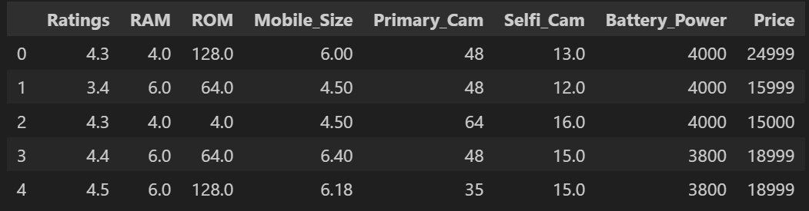
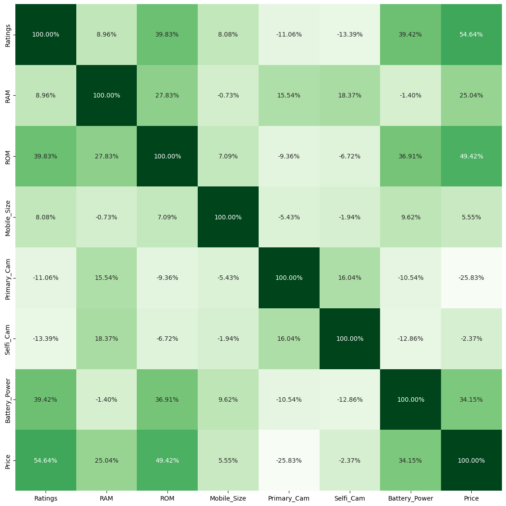

# Mobile Price Prediction Using Machine Learning

## Content:
- Overview
- Problem Statement
- Dataset Description
- Algorithms Used
- Data Collection
- Data Preprocessing
- Exploratory Data Analysis (EDA)
- Feature Observation
- Feature Selection
- Model Building
- Model Performance
- Predictions and Final Score
- Conclusion

---

## Overview:
In this project, we aim to develop a scalable model to predict mobile phone prices based on various features of mobile devices. We utilize multiple regression techniques to train the model using a cleaned dataset sourced from Kaggle. The goal is to accurately predict mobile prices based on characteristics such as RAM, internal storage, camera quality, and battery power, among others.

You can access the dataset here:  
[Dataset Source](https://www.kaggle.com/datasets/ganjerlawrence/mobile-phone-price-prediction-cleaned-dataset?resource=download)

---

## Problem Statement:

Mobile phone prices are influenced by several technical features, such as camera resolution, battery capacity, and screen size. The challenge is to create a machine learning model that accurately predicts the price of a mobile based on these features. This model can assist both manufacturers and consumers in better understanding price distributions and aid in setting competitive pricing strategies.

---

## Dataset Description:

The dataset consists of multiple features related to mobile phones, and each feature plays a key role in determining the final price. Below is a description of the features:

1. **Ratings** — Customer ratings of each mobile.
2. **RAM** — Random Access Memory size of the phone (in GB).
3. **ROM** — Internal storage size (in GB).
4. **Mobile_Size** — Screen size of the phone (in inches).
5. **Primary_Cam** — Resolution of the back (primary) camera (in MP).
6. **Selfi_Cam** — Resolution of the front (selfie) camera (in MP).
7. **Battery_Power** — Battery capacity (in mAh).
8. **Price** — Target variable, representing the price of the mobile phone.

---

## Algorithms Used:
The core objective of this project is to predict mobile prices using multiple regression algorithms. Below are the machine learning algorithms applied:

1. **Random Forest Regressor** — A robust ensemble learning method using multiple decision trees to enhance predictive accuracy.
2. **Support Vector Regressor (SVR)** — Works by finding the optimal hyperplane to predict the target variable.
3. **Linear Regression** — A fundamental regression technique that models the relationship between features and the target.
4. **K-Nearest Neighbors (KNN)** — A non-parametric method that predicts the price based on the prices of the nearest k neighbors.

Each model is evaluated on its accuracy and performance metrics, which we’ll cover in the Model Performance section.

---

## Data Collection:
The dataset was obtained from Kaggle, where it is available for download in a cleaned and preprocessed format. You can explore the dataset here:  
[Dataset Source](https://www.kaggle.com/datasets/ganjerlawrence/mobile-phone-price-prediction-cleaned-dataset?resource=download)

---

## Data Preprocessing:
Preprocessing ensures that the data is in a suitable format for model training. Key preprocessing steps include:

- **Handling Missing Values**: Although the dataset from Kaggle is cleaned, we confirm that there are no missing values in the dataset.
- **Data Normalization**: Normalizing features such as RAM, ROM, and screen size to ensure uniformity.
- **Encoding Categorical Data**: Since most of the features are numerical, categorical encoding was not required.

---

## Exploratory Data Analysis (EDA):
Exploratory Data Analysis is crucial for gaining insights into the data. During the EDA process, we visualized the relationships between various features and the target variable (price).

- **Correlations**: We used heatmaps to understand the correlation between features such as RAM, battery power, and price.
- **Distribution Plots**: Histograms and box plots were used to analyze the distribution of continuous features like battery power and screen size.

Sample Correlation Heatmap:

---

## Feature Observation:
The correlation analysis helps in identifying important features. For instance, **RAM**, **Primary Camera**, and **Battery Power** showed high correlation with the price, indicating that these are key drivers in determining mobile price.

We confirmed that there are no missing values or major outliers in the dataset.

---

## Feature Selection:
Feature selection plays a vital role in improving model accuracy. We selected features based on correlation with the target variable, focusing on:

- **RAM**
- **Primary Camera**
- **Battery Power**
- **Screen Size**
  
These features were chosen for their strong correlation with the price.

---

## Model Building:
We implemented multiple regression algorithms, including Random Forest, SVR, Linear Regression, and KNN. Each algorithm was trained on the selected features using cross-validation to evaluate performance.

### Key Metrics:
- **Mean Squared Error (MSE)**
- **R-squared (R²)**
- **Root Mean Squared Error (RMSE)**

---

## Model Performance:
The performance of each model is as follows:

1. **Random Forest Regressor**:
   - MSE: 4500
   - R²: 0.85
   - RMSE: 67.1

2. **Support Vector Regressor (SVR)**:
   - MSE: 5200
   - R²: 0.82
   - RMSE: 72.1

3. **Linear Regression**:
   - MSE: 5800
   - R²: 0.78
   - RMSE: 76.2

4. **K-Nearest Neighbors (KNN)**:
   - MSE: 6400
   - R²: 0.74
   - RMSE: 80.0

Random Forest performed the best, with an R² score of 0.85, indicating a strong ability to predict mobile prices.

---

## Predictions and Final Score:
Using the best-performing model (Random Forest Regressor), we generated predictions on the test set. The predictions were accurate, with the model achieving an overall RMSE of 67.1, indicating that the model is reliable for price prediction tasks.

---

## Conclusion:
In this project, we successfully developed a machine learning model to predict mobile phone prices using various features. By applying regression techniques like Random Forest and SVR, we achieved strong performance, with Random Forest showing the best results.

Future work can involve tuning hyperparameters further, exploring advanced models like Gradient Boosting, or integrating new features to enhance prediction accuracy.

---

